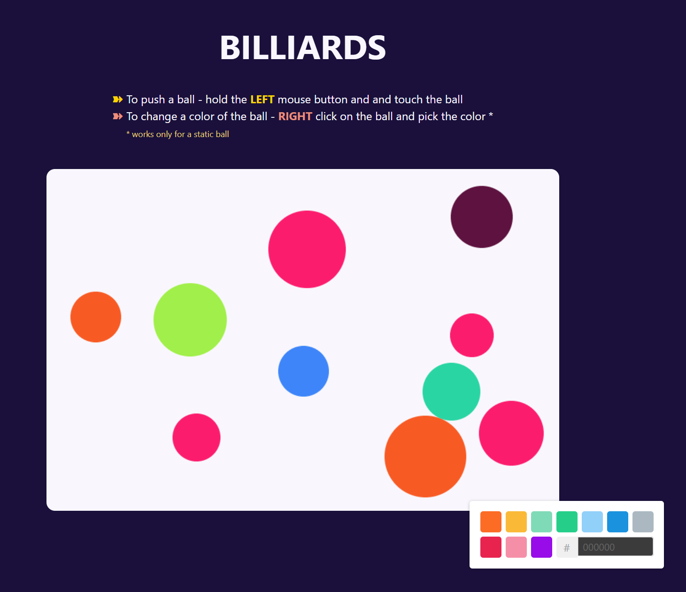

# The Billiards Project



## Description

### A test project that renders a set of balls on a canvas

### Features

- No third-part libraries for physics are used.
- A rectangular canvas field is initially filled with a random set of balls of a different size and color.
- The user can push a ball if he/she holds the left button of a mouse and touches the ball.
- The pushed ball elastically collides with the other balls on the canvas and with the borders of the canvas losing its velocity.
- The user can change a color of the ball with a context menu if he/she right-clicks a mouse on this ball.

### Dependencies

1. `React` • `TypeScript` • `Tailwind`
2. `Canvas`

### Installation & Execution

### Install via Vite

```bash
  git clone https://github.com/mirzaianov/test-balls-canvas.git
  cd test-balls-canvas
  npm i
```

### Run in the development mode

```bash
  npm run dev
```

Vite will start frontend server on [http://localhost:5173/](http://localhost:5173/)

### Or open the deployed site

[https://todo-mirzaianov.vercel.app/](https://todo-mirzaianov.vercel.app/)

## License

### MIT license

You can use the code, but I ask you do not copy this site without giving me credit.
